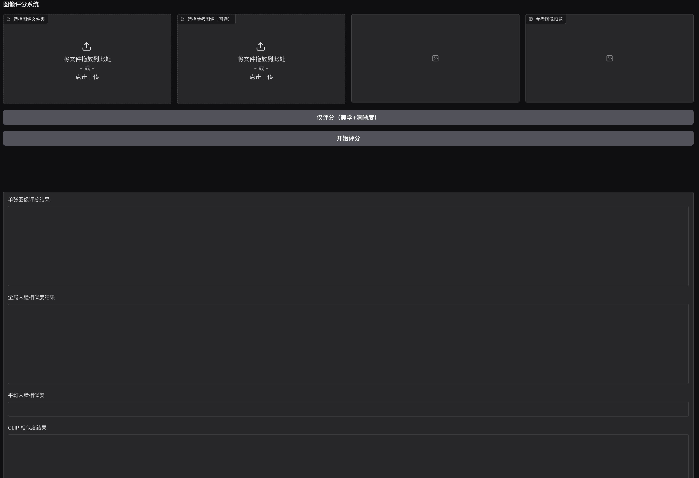

# AI Comic Image Scorer

本项目是一个基于 Gradio 的图像评分系统，支持美学分、清晰度、人脸相似度、CLIP 相似度等多维度自动打分，适用于漫画、插画等图片的批量筛选与分析。

## 主要功能
- 批量图片美学分、清晰度评分
- 支持参考图像的人脸相似度对比
- 支持全局人脸相似度、CLIP 相似度分析
- 评分结果可视化展示与 CSV 导出
- 简洁易用的 Web 界面（Gradio）

## 安装依赖
```bash
pip install -r requirements.txt
```

## 运行方法
```bash
python app.py
```
默认本地启动，若需服务器部署并公网访问：
```python
# app.py 末尾
# demo.launch(server_name="0.0.0.0", server_port=7860, share=False)
```

## 使用说明
1. 上传待评分图片文件夹
2. （可选）上传参考图像
3. 点击"开始评分"或"仅评分"按钮
4. 查看评分结果、相似度分析、下载 CSV

## 示例界面


## 依赖环境
- Python 3.8+
- torch >= 2.6
- gradio
- numpy, pillow, ...（详见 requirements.txt）

## 贡献&致谢
- 本项目部分评分模型基于开源项目/模型
- 欢迎 issue/PR 反馈与贡献 